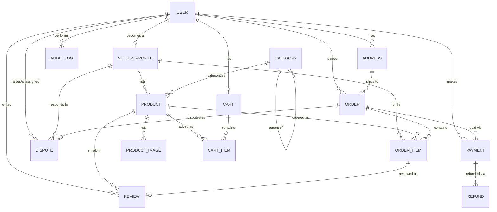
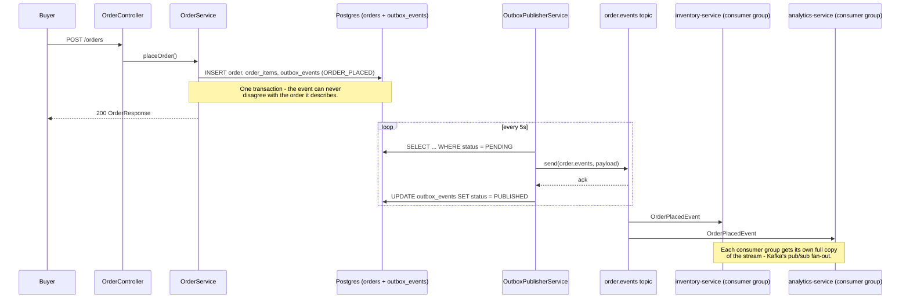
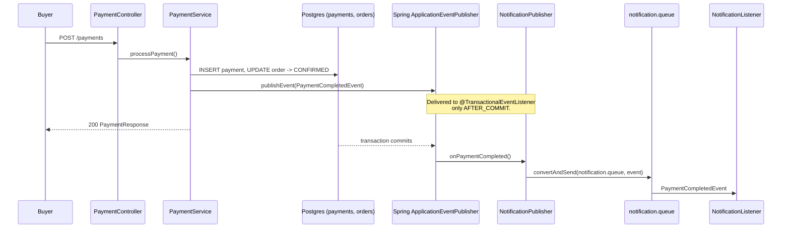
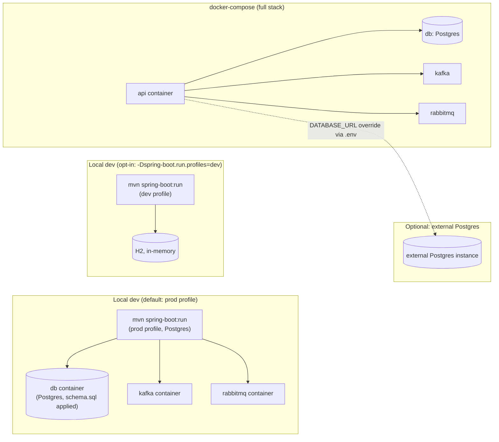

# Architecture

This document is the deep-dive companion to [`README.md`](README.md) (which covers
day-to-day setup). It covers how the system is put together: layering, the domain
model, the event-driven flows, and the design decisions (and a couple of hard-won
gotchas) behind them.

## 1. Layered structure

A single Spring Boot module, layered by responsibility rather than by feature:

```
controller/   @RestController - HTTP only, no business logic
service/      business logic, @Transactional lives here (incl. Kafka/RabbitMQ
              producers & consumers - they're just another kind of business logic
              trigger, so they live alongside the services that own the workflow)
repository/   Spring Data interfaces, derived query methods only
dto/          request/response records - entities never cross the controller boundary
model/        JPA entities
event/        Kafka/RabbitMQ event payload records (distinct from dto/ - these
              cross a broker boundary, not an HTTP boundary)
exception/    custom exceptions + a single @RestControllerAdvice handler
config/       beans: Kafka topics, RabbitMQ queues/converters, OpenAPI, CORS
```

Controllers depend on services, services depend on repositories - never the reverse,
and never controller-to-repository directly. Validation happens at the edge (Bean
Validation annotations on request DTOs); services assume the input they receive is
already valid.

## 2. Domain model



`User` is the aggregate root of identity - almost every other entity references it
directly, each in a different role (buyer, seller-behind-a-shop, dispute admin, audit
actor). That's *why* it's the most-connected node in the codebase, not a smell -
see the [graphify](https://github.com/safishamsi/graphify) knowledge-graph analysis
in `graphify-out/` (gitignored, regenerate with `/graphify`) for the full trace.

`OutboxEvent` is deliberately not part of this diagram - it's infrastructure for the
event-driven flow below, not a domain concept.

## 3. Event-driven flows

Two brokers, used for genuinely different reasons - not interchangeably.

### Kafka: order events (transactional outbox, pub/sub fan-out)



**Why the outbox, not a direct publish from the request thread:** publishing to Kafka
inside the same request as the DB write creates a dual-write problem - if the DB
commits but the Kafka send fails (or vice versa), the two systems disagree forever.
Writing the event to a DB row in the *same transaction* as the order means "order
placed" and "event recorded" can never disagree, and a separate poller decouples
"did we record the event" from "is the broker reachable right now." The trade-off is
the ~5s publish delay, and (as a single-instance poller) that a second app instance
would double-publish the same rows - see the comment on `OutboxPublisherService`.

### RabbitMQ: payment notifications (lighter-weight, best-effort)



**Why this is lighter than the outbox:** a rolled-back payment must never trigger a
notification, so delivery is gated on `AFTER_COMMIT` - but there's no durable outbox
row behind it. If the process crashes between the DB commit and the Rabbit publish,
that one notification is lost. That's an acceptable trade for a best-effort side
effect like an email; it would not be acceptable for the order-event fan-out Kafka
handles, which is why the two brokers use different patterns rather than the same
one twice.

## 4. Design decisions and gotchas worth knowing

- **Lombok `@Builder` silently drops field initializers.** Every entity has fields
  like `private LocalDateTime createdAt = LocalDateTime.now();` - but Lombok's
  generated builder ignores that initializer entirely unless the field is also
  annotated `@Builder.Default`. Every entity in `model/` has this annotation on every
  field with a default (timestamps, enum defaults, counters, and collection
  initializers like `new HashSet<>()`) precisely because this bit us: without it,
  building an entity via `.builder()...build()` without explicitly setting a field
  leaves it `null`, which either violates a `NOT NULL` column at insert time or NPEs
  on first read of an "always initialized" collection.
- **Lombok `@Data`'s generated `equals()`/`hashCode()` recurses on bidirectional
  relations.** `@Data` covers every field by default; a bidirectional pair like
  `Order.items` / `OrderItem.order` recurses infinitely the moment Hibernate compares
  them (e.g. any `HashSet` operation, which is everywhere in JPA-managed
  collections). Every entity uses `@EqualsAndHashCode(onlyExplicitlyIncluded = true)`
  with `@EqualsAndHashCode.Include` on just `id` - the standard fix, and the reason
  none of these classes rely on `@Data`'s default equality.
- **Order confirmation is one-directional.** `OrderService` never confirms its own
  orders - only `PaymentService.processPayment()` calls `orderService.confirmOrder()`,
  keeping "a completed payment is the only thing that moves PENDING -> CONFIRMED" as
  an invariant enforced in one place.
- **Stock is reduced once, at order placement**, not per payment attempt - a failed
  payment leaves the order `PENDING` (retry or cancel-for-restock), it does not
  re-reduce or restore stock.
- **Roles are just booleans on `User`** (`isBuyer`, `isSeller`, `isAdmin`), not a
  separate roles/permissions table - there's no session or JWT, so the API has no
  concept of "the caller" independent of the ids the client sends. Admin endpoints
  (`UserController`'s suspend/reactivate/admin-role/seller-role, `SellerProfileController`
  verify/reject, `DisputeController` assign/resolve) take an `adminUserId` query
  param purely for the `AuditLogService` trail - the server never checks that id's
  `isAdmin` flag before acting on it. `isAdmin` gates the frontend's `/admin/*` pages
  (Ecommerce nuxt js's `admin.ts` middleware) but is not a real security boundary;
  anyone who can reach the API directly can call these endpoints regardless of role.

## 5. Deployment topology



Note the prod profile still needs `ddl-auto: validate` satisfied by hand - `docker-compose up db kafka rabbitmq` to start the brokers, then `sql/schema.sql` applied once against `demodb` (Hibernate won't create the schema itself in this profile, unlike the `dev`/H2 path where `ddl-auto: update` does it automatically).

`docker-compose.yml`'s `api` service reads `DATABASE_URL` / `DATABASE_USER` /
`DATABASE_PASSWORD` with the local `db` service as the default - a local, gitignored
`.env` file can override all three to point the container at any reachable Postgres
instance instead, without editing the compose file or committing credentials. Kafka
and RabbitMQ are unaffected by this - they're always the containers in the same
compose network.

## 6. Testing approach

Controller tests use `@WebMvcTest`, repository tests use `@DataJpaTest`, everything
else is a plain Mockito unit test - none of it requires Kafka, RabbitMQ, or Postgres
to be running (`mvn test` is fully self-contained). The outbox and messaging code
specifically has coverage for: the outbox write happening in the same transaction as
the order, the PENDING->PUBLISHED and PENDING->FAILED transitions in
`OutboxPublisherService`, the `PaymentCompletedEvent` publish (and non-publish on a
declined payment), and smoke tests for all three consumers.
